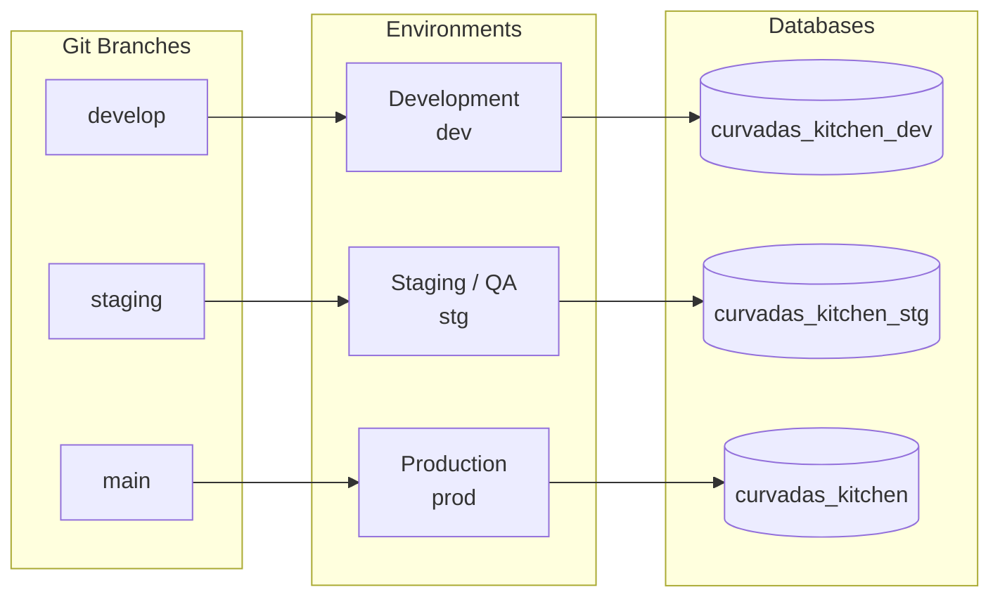

# Curvada's Kitchen — Environments, Git Branches & CI/CD Deployment Guide

This guide details the multi-environment architecture, Git branching conventions, automated GitHub Actions CI/CD workflows, and local run configurations for **Curvada's Kitchen**.

---

## 1. Environment Architecture Overview

The system is configured with 3 isolated environments across Backend, Web App, and Flutter Apps:



| Environment | Purpose | Branch | Backend Env File | Frontend Env File | Database |
|---|---|---|---|---|---|
| **Development** (`dev`) | Active daily feature development | `develop` | `backend/.env.dev` | `.env.development` | `curvadas_kitchen_dev` |
| **Staging** (`stg`) | QA testing, client preview, pre-release | `staging` | `backend/.env.stg` | `.env.staging` | `curvadas_kitchen_stg` |
| **Production** (`prod`) | Live store operations & customer orders | `main` | `backend/.env.prod` | `.env.production` | `curvadas_kitchen` |

---

## 2. Git Branching Strategy & Workflow

### 2.1 Branch Conventions
* **`develop`**: The primary branch for daily active development. All new features and bug fixes merge here first.
* **`staging`**: Release candidate branch for integration testing and staging verification.
* **`main`**: Production-ready code only. Tagged with version releases (e.g. `v1.0.0`).

### 2.2 Standard Development Flow
```bash
# 1. Create a feature branch from develop
git checkout develop
git pull origin develop
git checkout -b feature/pos-split-payment

# 2. Commit your work
git add .
git commit -m "feat(pos): add split payment calculation"

# 3. Push and open PR to develop
git push -u origin feature/pos-split-payment
# -> Merge into develop -> Triggers Dev CI Build

# 4. Release to Staging for QA
git checkout staging
git merge develop
git push origin staging
# -> Triggers Staging CI Build & Auto-Deploy

# 5. Promote to Production
git checkout main
git merge staging
git push origin main
# -> Triggers Production Build & Deployment
```

---

## 3. GitHub Actions CI/CD Workflows

All automated CI/CD workflows are stored in [`.github/workflows/`](file:///.github/workflows):

### 3.1 Backend Workflow ([`backend-ci-cd.yml`](file:///.github/workflows/backend-ci-cd.yml))
* **Triggers**: On `push` or `pull_request` to `develop`, `staging`, or `main` when files in `backend/**` change.
* **Pipeline Steps**:
  1. Checks out repository.
  2. Sets up Node.js 20 with npm caching.
  3. Installs clean dependencies via `npm ci`.
  4. Runs TypeScript compiler check (`npm run build`).
  5. Determines target environment (`development`, `staging`, or `production`) based on branch reference.
  6. Executes smoke tests & build verification.

### 3.2 Web App Workflow ([`webapp-ci-cd.yml`](file:///.github/workflows/webapp-ci-cd.yml))
* **Triggers**: On `push` or `pull_request` to `develop`, `staging`, or `main` when frontend files change.
* **Pipeline Steps**:
  1. Installs npm dependencies.
  2. Compiles Vite production bundle (`npm run build`).

---

## 4. Local Development Commands

### 4.1 Backend (`backend/`)
Navigate to `d:\DEVELOPMENT\curvada's-kitchen\backend`:

```bash
# Run in Development mode (default: loads .env.dev)
npm run dev

# Run in Staging mode (loads .env.stg)
npm run dev:stg

# Run in Production mode (loads .env.prod)
npm run dev:prod

# Compile TypeScript to dist/
npm run build

# Start compiled production server
npm run start
npm run start:stg
npm run start:dev

# Run database migration (db.json -> MongoDB)
npm run migrate:json-to-db
```

### 4.2 Web App (`curvada's-kitchen/`)
Navigate to `d:\DEVELOPMENT\curvada's-kitchen`:

```bash
# Start Vite development server (proxies to backend on port 5000)
npm run dev

# Build production web bundle
npm run build
```

---

## 5. Upcoming Flutter Apps Flavors Configuration

When developing the **Customer App** and **POS App**, the same 3-tier flavors will be utilized:

| Flavor | Flutter Run Command | Target Backend URL |
|---|---|---|
| **Development** | `flutter run --flavor dev --dart-define=ENV=dev` | `http://localhost:5000/api/v1` or dev cloud URL |
| **Staging** | `flutter run --flavor stg --dart-define=ENV=stg` | Staging cloud URL |
| **Production** | `flutter run --flavor prod --dart-define=ENV=prod --release` | Production cloud URL |
